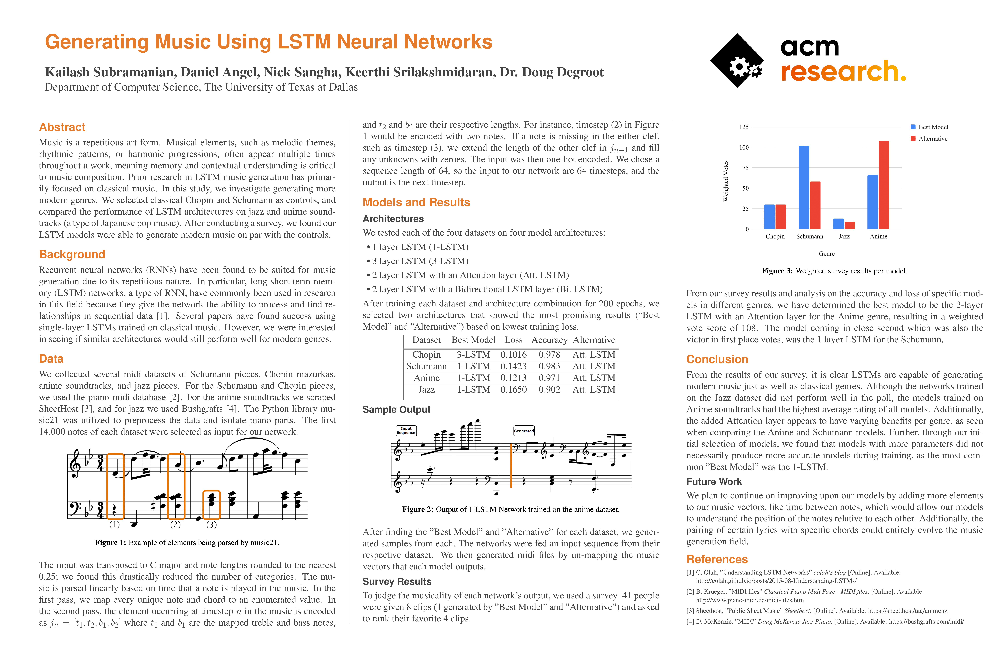
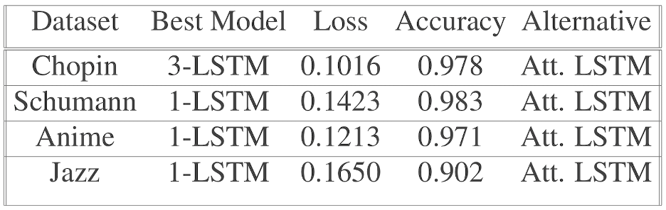
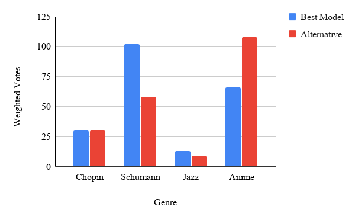

# Generating Music using an LSTM Neural Network

## Poster

## Abstract
Music is a repetitious art form. Musical elements, such as melodic themes, rhythmic patterns, or harmonic progressions, often appear multiple times throughout a work, meaning memory and contextual understanding is critical to music composition. Prior research in LSTM music generation has primarily focused on classical music. In this study, we investigate generating more modern genres. We selected classical Chopin and Schumann as controls, and compared the performance of LSTM architectures on jazz and anime soundtracks (a type of Japanese pop music). After conducting a survey, we found our LSTM models were able to generate modern music on par with the controls.

## Data
We collected several midi datasets of Schumann pieces, Chopin mazurkas, anime soundtracks, and jazz pieces. For the Schumann and Chopin pieces, we used the piano-midi database. For the anime soundtracks we scraped SheetHost, and for jazz we used Bushgrafts. The Python library [music21](https://github.com/cuthbertLab/music21) was utilized to preprocess the data and isolate piano parts. The first 14,000 notes of each dataset were selected as input for our network. 

## Models
We tested each of the four datasets on four model architectures: 1 Layer LSTM, 2 Layer LSTM with an Attention Layer, 3 Layer LSTM, and a 2 Layer LSTM with a Bidirectional LSTM Layer.

## Results
To judge the musicality of each network's output, we used a survey. 41 people were given 8 clips (1 generated by "Best Model" and "Alternative") and asked to rank their favorite 4 clips. The graph below shows the results of the survey after calculating the total weighted votes by genre.

The clear winner is the 2 Layer LSTM with an Attention Layer from the Anime genre and the runner up model was the 1 Layer LSTM from the Schumann genre, with no other model coming close.

## Contributors

- [Kailash Subramanian](https://github.com/kaisubr)
- [Daniel Angel](https://github.com/danielkangel)
- [Nick Sangha](https://github.com/Nirvair-Sangha)
- [Keerthi Srilakshmidaran](https://www.linkedin.com/in/keerthi-srilakshmidaran/)
- [Viswajith Rajagopalan](https://github.com/ViswajithRajagopalan) - Research Lead
- [Dr. Doug DeGroot](https://cs.utdallas.edu/people/faculty/degroot-doug/) - Faculty Advisor
